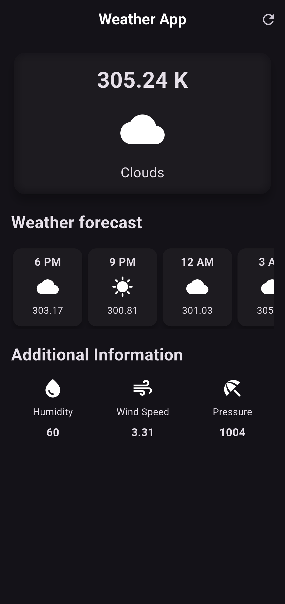

# 🌤️ Flutter Weather App — Version 02

Welcome to the **Version 02** of my Flutter Weather App!  
This version introduces a **modern and aesthetic UI** for better readability and user experience 🌈✨

## 🖼️ Preview

> Temperature is shown in **Kelvin**, along with weather status, hourly forecast, and additional information like humidity, wind speed, and pressure.

---

## 🚀 Features
- 🌡️ Real-time weather updates in Kelvin
- 🕰️ Hourly forecast cards
- ☁️ Weather status icon (clouds, sun, etc.)
- 💧 Humidity, 🌬️ Wind speed, and 🧭 Pressure display
- 🌙 Dark theme for a sleek look

---

## 📦 Tech Stack
- 🔧 Flutter
- 📡 OpenWeatherMap API (or similar)
- 💅 Custom dark UI with icons and layout

---

## 📂 Folder Structure
```
lib/
├── widgets/
│   ├── additional_info.dart
│   ├── hourly_forecast_card.dart
│   ├── files.dart
│   ├── main.dart
│   └── weather_app_page.dart
assets/
└── screenshots/
    └── weather_app_v02.png
```

---

## 🛠️ Setup & Run
```bash
git clone https://github.com/OnoPUNPUN/WeatherApp.git
cd flutter_weather_app
git checkout version_02
flutter pub get
flutter run
```

---

## 💡 Future Improvements
- Toggle between Celsius/Kelvin/Fahrenheit
- Location-based weather search
- Weekly forecast display
- Light/Dark theme switch

---

## 👨‍💻 Author
Made with ❤️ by **Tonmoy**

---

⭐ **Star this repo** if you found it helpful!