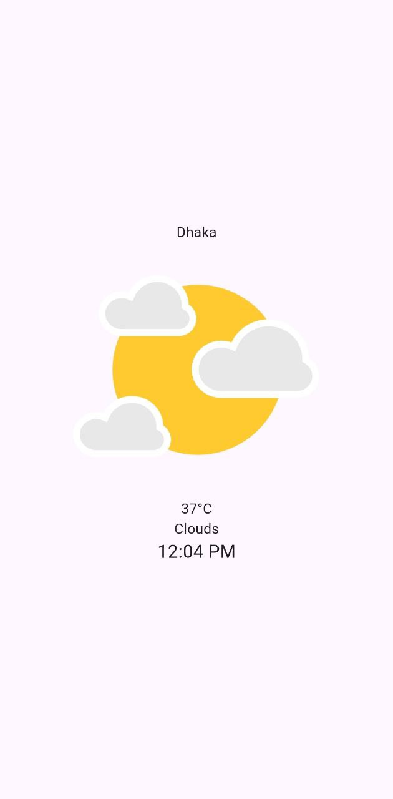

# 🌤️ Flutter Weather App

A simple and clean weather app built using **Flutter**. It fetches real-time weather based on the user's current location using the **OpenWeatherMap API** and displays temperature, city name, and current time.

---

## 🚀 Features

- 🌍 Location-based weather fetching
- 🌡️ Real-time temperature display
- 🕒 Current time shown with formatted output
- ✨ Smooth animations

---

## 📸 Screenshots

<!-- Add your screenshots here -->
<p float="left">
  
</p>


---

## 🛠️ How to Run

1. **Clone the repository:**
   ```bash
   git clone https://github.com/OnoPUNPUN/WeatherApp.git
   cd weather_app
